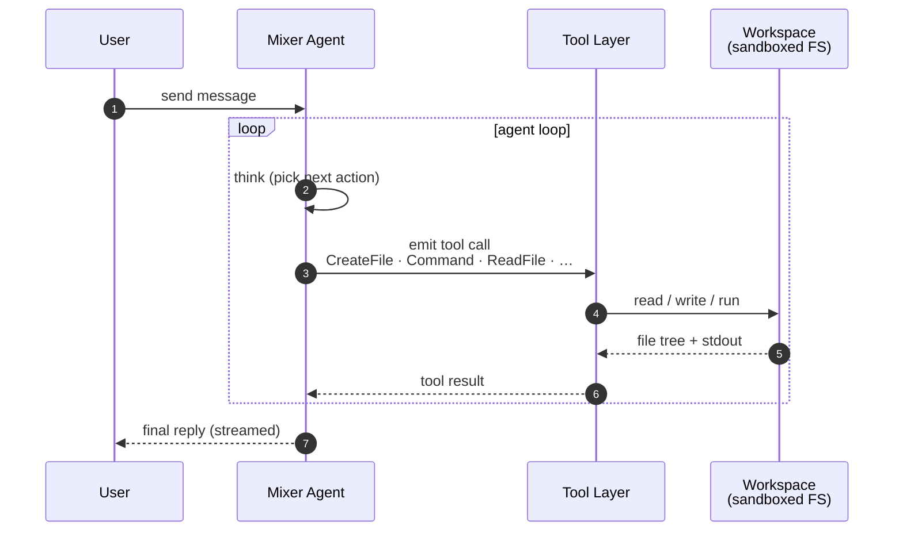

# Mixer

> A hosted AI agent that takes a business request, spins up a sandboxed workspace, writes real files, runs real commands, recovers from failures, and streams its progress back live.

Built for the **AI Agent Olympics Hackathon 2026** — Vultr submission.

## How it works

