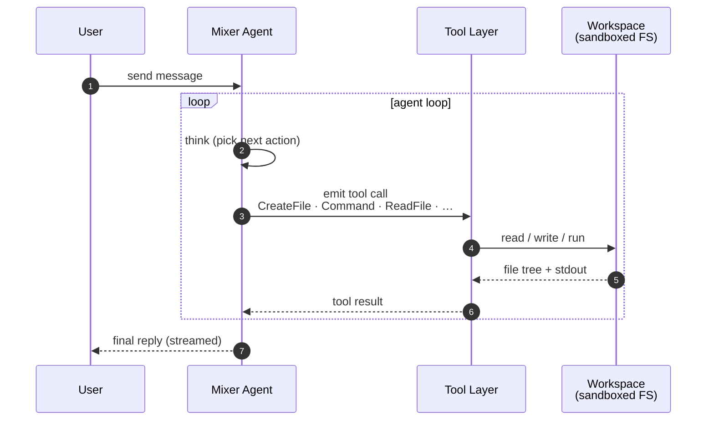
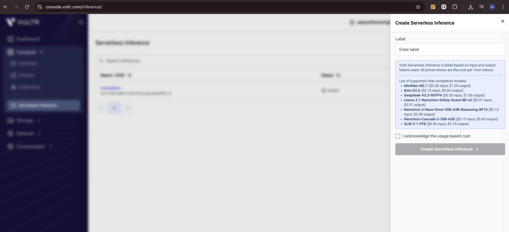
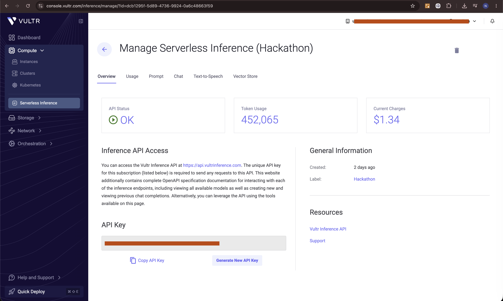

# Mixer

> A hosted AI agent that takes a business request, spins up a sandboxed workspace, writes real files, runs real commands, recovers from failures, and streams its progress back live.

> [!NOTE]
> Mixer was built for the **AI Agent Olympics 2026 and TECHEX Hackathon 2026 on lablab.ai** as a **Vultr submission**.

## How it works

## How to install?
1. Login to Vultr and create an account
2. Go to https://console.vultr.com/inference and Create a new Inference instance

3. Get the API key for that instance and keep it with you!
4. Go to https://console.vultr.com/startup/ and create a new startup script with the following content (replace the env vars with your own values) and save it.[Head over to the install.sh file](install/install-dep.sh)
> [!NOTE]
> Please copy and paste and change the env vars in the script, do not upload the file or anything because of the env vars and stuff, just copy paste the content and change the env vars to your own values and then save it as a startup script in vultr. :pray: im begging you.

5. Create a new instance (baremetal, shared or dedicated) and in the startup script section select the startup script you just created and then create the instance
6. Wait for the instance to be ready and then you can access the app at http://<your-instance-ip>:<the port you choose in the script, default is 3000>

## Current status
- [x] Core agent loop with tool calls
- [x] Durable chat that can recover from refreshes and etc
- [x] Workspace syncing.
- [x] Mermaid diagram support in chats
- [x] Skill system
- [ ] Hooks system for external API calls
- [ ] Connect to computers / other systems to control them (only ssh for now)

